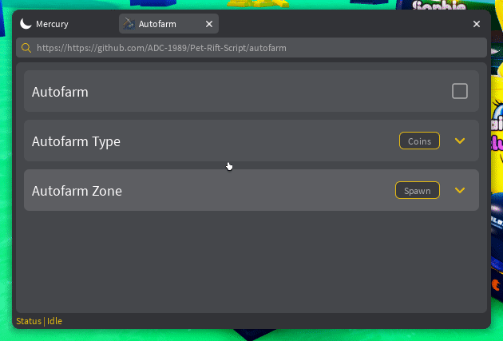
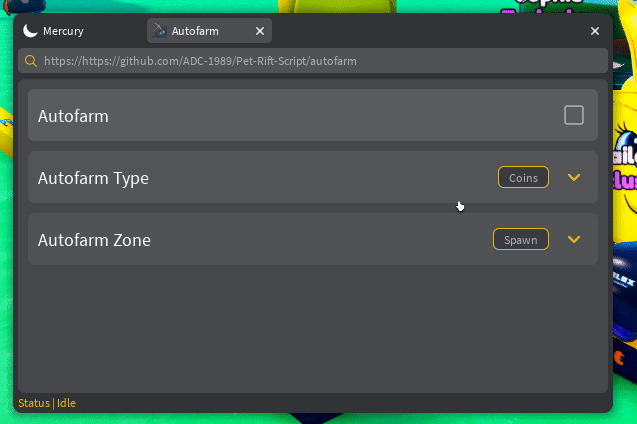
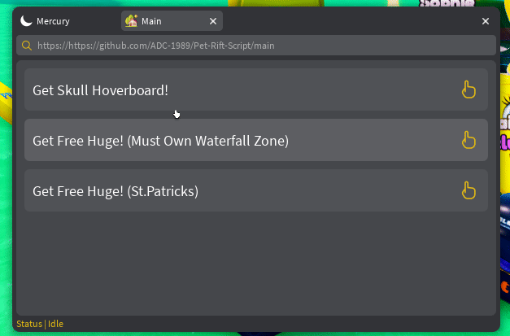

## Pet Rift Script
- A pet rift script made by me and using mercury lib
```lua
loadstring(game:HttpGet("https://raw.githubusercontent.com/ADC-1989/Pet-Rift-Script/main/Main.lua"))()
```

## Usage

### Autofarming
- First select the autofarm type (Coins, Crates, Safes, Vaults, All)


- Then select the autofarm zone (Spawn, Spring, Fantasy Fature, etc.)


- Finally enable the autofarm by clicking the tick


### Getting free huges and free hoverboard
- Simply go to the "Main" tab with the house icon and select the option you want


